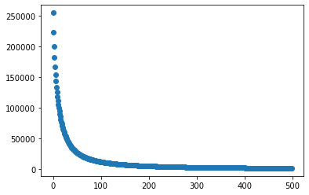
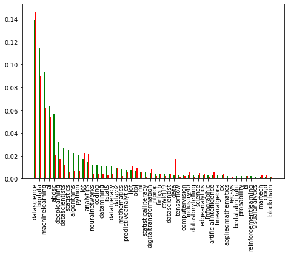
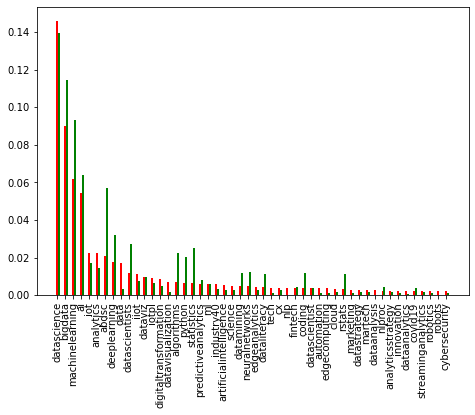
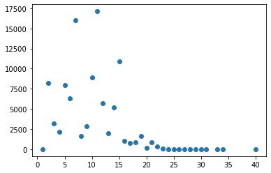
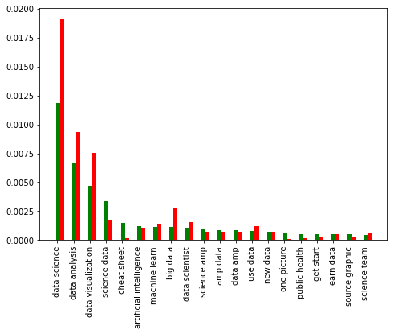
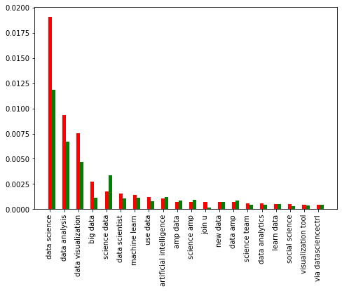

## Table of content

1. [About](#About)
    - [Goals](##Goals)
    - [About the dataset](##About)
2. [Preprocessing](#Preprocessing)
    - [Labeling the data](##Labeling)
    - [Splitting the data](##Splitting)
    - [Timedeltas](##Timedeltas)
    - [Removing Hashtags](##Removing)
    - [Punctuation Remover](##Punctuation)
    - [Lowercase](##Lowercase)
    - [Abbrevation replacement](##Abbrevation)
    - [Tokenization](##Tokenization)
    - [Stopword removal](##Stopword)
    - [Part of speech tagging](##Part)
    - [Lemmatization](##Lemmatization)
3. [Feature Extraction](#Feature)
    - [Hashtags and timedeltas](##Hashtags)
    - [ngrams and character length](##ngrams)
4. [Dimensionality Reduction](#Dimensionality)
    - [mutual information](##mutual)
    - [pca](##pca)
5. [Evaluation Metrics](#Evaluation)
    - [accuracy](##accuracy)
    - [Cohen Kappa](##Cohen)
    - [F1 score](##F1)
6. [Classification](#Classification)
    - [Majority vote classifier](##Majority)
    - [Support vector machine](##Support)
    - [Multi layer perceptron](##Multi)
    - [Randomforest](##Randomforest)
6. [Evaluation](#Evaluation)

## About 

A few sentences about the project

### Goals 

This project was implemented for the course "Machine Learning in practice" from the university
of osnabrueck in the winter term 21/22. Its goal is to develop a machine learning
pipeline, which is able to determine if a tweet is going viral. 

### About the dataset 

I am using a dataset which contains information and metadata of almost 300.000 tweets,
which were posted by verified accounts. And here is the biggest weakness of the dataset.
Most people don't have a verified account. So applying the classifier to a tweet posted by a non viral 
account wouldn't return accurate results. The reason for this is the following:

To verify an account on Twitter, it has to be of public interest, notable and active [1]. This will
lead to a bigger follower base and the more followers you have, the more people
will like and share your tweet. Another effect is that tweets from verified persons
are usually liked and shared more than tweets from regular people.

## Preprocessing 

Let's consider a huge dataset from different websites, including a lot of customer data. 
These websites might save their data in different format. The format from website 
1 could be: STREET,HOUSE_NOUMBER,POSTCODE while the format from website 2 could be: POSTCODE,STREET,HOUSE_NUMBER.
So in the worst case, your machine learning model might interpret the postcode as the street and the other way around.

The first goal of the preprocessing step is to bring the data into a uniform format. 
The second goal of the preprocessing step is to represent the formatted data in such a way, that 
data with the same meaning is represented the same. Of course, this means that valuable information could be lost,
but this tradeoff will be discussed in the individual preprocessing steps.

For example, take the two sentences "I am cool", "i am so COOL". Its easy to see, at least for us humans, that these
sentences mean almost the exact same thing. And in addition they have the same format, namely both are a string. But a 
computer, without additional natural language processing, would consider them two completely different sentences, and this 
is a problem. 

I decided not to create an extra column with a suffix in the .csv file for every preprocessing step. Instead, I decided
that, in most cases, each preprocessing step would overwrite an already existing column. This makes it easier for preprocessing
and feature extraction, as I don't have to worry about a suffix missing if I try to exclude a preprocessing step.

### Labeling the data 

As the data comes unlabeled, the first step is to assign a label to it. In this case, the label is either going to be "viral", represented
by a 1, or "not viral", represented by a 0. For a tweet to be viral, its likes and retweets combined have to be greater than 50. 
There might be a lot of people who wouldn't consider this viral or even close to viral. But to understand this decision, one has to 
take a look at the dataset.

On the x-axis are integers representing threshold values and on the y-axis the number of tweets,
whose number of likes and retweets combined surpass this threshold.
For a high threshold, consider roughly 300 or 400, there are only very few tweets which would be labeled as viral. This would lead
to an uneven distribution of positive and negative samples in the data set (99.9% positive 0.01% negative), which leads to the
classifier, not having enough negative samples to learn something reasonable. On the other hand, taking a lower threshold leads to a better
distribution (50% positive, 50% positive) but a tweet with 10 likes can't be considered viral. So the goal is to set
the threshold as high as possible while still maintaining a good distribution. And because the threshold of 50 has a distribution
of roughly 90/10, which is still acceptable considering the 300.000 tweets, I decided to stick with 50.

### Splitting the data 

There are several ways to split your data, and the most important factor when deciding which method to take is the number of samples.
Considering the big data set, I decided to split the data into a training, a validation and a test set with the distribution 60/20/20.
The training set will be, as the name already says, used for training the model, the validation set will be used
for optimizing the hyperparameters and the test set will be used for evaluating the final model.

### Timedeltas 

From now on, I will refer to the "whole date", consisting of year, month, day, time... as "datetime"
and to the date, consisting only of month and day as "date"

Because I want to use the creation datetime as a feature, I had to find a format, which the sklearn model would
be able to read. I decided to use the so called "deltatime", which is just the time span between two datetimes. 
Here, the deltatime will be represented in seconds.
The reference time used to calculate the timedeltas will be the twitter creation datetime, 
as no tweet could have been posted before this. 

The following preprocessing steps will be about preprocessing the semantics of the actual tweet and not the metadata.

### Removing Hashtags 

The dataset is formatted in such a way, that hashtags which were used are still present in the tweet and 
are stored in a list in an extra column. Because this extra column will be used when getting the most used hashtags,
having them still in the tweet will lead to the same information twice when analysing ngrams. For this reason,
every word that starts with a "#", will be removed from the tweet. So the tweet: "I used a #hashtag"
will become "I used a". On the internet, it is a convention to mention all hashtags at the end of the tweet. So
a tweet would usually be structured like this in most cases: [tweet] [all hashtags]. Because the tweets
are all about the same topic, namely data science, machine learning etc., the hashtags among all tweets will be 
more or less the same. This means, the most frequent ngrams among all tweets will be combinations of different
hashtags. But this information, which tweets contain which hashtags, is already encoded in another feature. So it 
would not make sense to leave the hashtags in the tweet.

Of course, one problem could be that the meaning of the tweet will be destroyed, e.g. if the user
decides to use a hashtag in the sentence: "I #didn't do it" -> "I do it". But this problem will be
neglected, as there is no "high end" natural language processing step in the pipeline.

### Punctuation remover 

Removing punctuation reduces the overall complexity of the tweet, and makes it easier to apply basic natural language
processing. Consider the tweet: "I love dogs, cats and mice", and its tokenized form ["I", "love", "dogs", ",", "cats", "and", "mice"].
Due to the comma being recognized as a word by the nltk tokenizer, the bigram ("dogs","cats") won't be part of the tweet any more.
Instead, this would generate two new bigrams: ("dogs", ",") and (",", "cats"). Because the overall task is to analyse
the semantics of the tweet and not the syntax, the first version with only one bigram is preferable. Furthermore, having a lot
of punctuation in a tweet leads to more bigrams, which increases the overall complexity and computing time of the pipeline.

The drawback on the other hand is that often punctuation can play an important role in semantics and influence
the overall meaning of the tweet. There exists this famous example on how
important proper punctuation is: "Let's eat, grandpa" and "Let's eat grandpa".

Furthermore, this is one of the few steps where it is critical to look at the order in which the preprocessing steps are implemented. 
Because we want to replace abbreviations with their long form later, so "isn’t" becomes "is not", we have to be
careful to not delete the "’", because "isnt" will not be recognized by the abbreviation replacement any more. 

To get a list with all the punctuation that should be removed, I decided to use pythons build in string.punctuation constant.
And luckily the "’" symbol is not a part of that list, so there is no need to worry about the above problem.  

### Lowercase 

Because most preprocessing steps deal with recognizing and replacing words, it is convenient to not have to worry about lower and upper case in
the tweet. For this reason, all letters in the tweet will be replaced with their corresponding lower case letter. In addition, this reduces
the overall number of words and ngrams we have to consider for feature extraction, because "ML" and "ml" would be two different words due
to the casing.

However, this might lead to a loss of information. On the internet it is common to express irony by replacing every second or third letter
in the sentence with an upper case letter. So the sentences "I like dogs" and "I lIkE dOgS" would have completely different meanings.
But I assume that instances where cases matter appear relatively little to none in the database, and the positive effects predominate.

### Abbrevation replacement 

The English language consists of many abbreviations and short forms, like "isn't" or "doesn't". They unnecessarily boost the number
of total, words and ngrams and are therefore superfluous, and therefore will be replaced with their corresponding long form. 
For this, I made a dictionary containing the most common abbreviations.

### Tokenization 

Because it is hard to access individual words if the tweet is represented as a string, the tweet will be tokenized using nltks build in tokenizer.

### Stopword removal 

Words which appear everywhere in a language are called stopwords. Consider "are" or "is". The problem is, that these kinds of words, because of their high frequency,
store no valuable information about the semantics of a sentence. For example, when analysing unigrams, the most 5 frequent unigrams will with a high
probability be only stopwords. If one now hot encodes these unigrams, almost every tweet would have the feature vector (1,1,1,1,1). For this reason stopwords
are removed from the tweet.

The stopwords are taken from nltks build in set of stopwords in the English language. Here, it is not feasible to analyse the tweets for their most frequent words
and then remove these. This is, because we might remove different words from the training and test set, because fit_transform is called in the preprocessing 
pipeline, and thus the frequency analysis is performed on both sets. If one wants to remove frequent words, it has to be implemented as a feature as here, fit is
only called on the training set. But this will not be done here.

However, an important aspect is to think about how important stopword removal really is. If the 1000 most common unigrams are one hot encoded, a dimension reduction method
like, taking the features with the highest mutual information, will automatically dispose of these stopword features. But to lower the number of data to analyse and to lower the runtime,
they will still be removed.

### Part of speech tagging 

This preprocessing step will assign the corresponding part of speech tag to each word using nltks build in pos tagger. This information will be used for
further preprocessing. For example, take the sentence ["I", "went", "viral"]. The associated part of speech tagged sentence would look like this: [("I", "PRP"),("went", "VBD"),("viral", "JJ")]

### Lemmatization 

Consider the sentences, "I ran to you", "I run to you". Besides the tense, these two sentences have the exact same meaning. But as mentioned earlier, these 
two sentences would be completely different for a computer. And in addition to that, these two sentences would only share one out of three ngrams. Lemmatization 
is the process of finding the lemma for a given word and replacing it in the sentence. The lemma for the word "running" would be "run" and the lemma
for the word "ran" would be "run". This is done using nltks build in wordnet lemmatizer.

However, it is not advisable to just apply lemmatization to a given word, because this word could be a noun or a verb. Without further knowledge, if a word could have multiple
positions, the lemmatizer will interpret this word as a noun, which could lead to a sentence with a completely different meaning. For this reason, the corresponding 
part of speech tag will be transformed into a wordnet position and will be given as an argument to the lemmatizer

Of course, as mentioned earlier, this leads to a loss of information, e.g. the tense of a sentence. But the gained standardizing of the 
dataset is worth more.

## Feature Extraction 

To know which features to extract for the classifier, one has to have a basic knowledge about twitter and take a look at the data set.
In order for a tweet to get viral, as a first step, it has to be found by people, and as a second step, people have to like and retweet it. 
The following features will take either one of these steps into consideration.

### Hashtags and timedeltas 

An important functionality of Twitter are hashtags. By mentioning a hashtag with the prefix "#" in your tweet, it will be associated
with all other tweets that have this hashtag. In addition to that, users can search for specific hashtags and look at all these associated tweets.
This makes hashtags a good way of finding relevant tweets. 

To convert the hashtags into a feature, I count the frequency of each hashtag, take the 100 most frequent and use one hot encoding to determine
if a tweet uses one of these hashtags. I am using this many hashtags, because I want the dimensionality reduction method to choose the best features, and
the most common hashtags might not be best suited as a feature. On the other hand, taking more hashtags isn't good either, because it takes a lot of time
to one hot encode, and a hashtag which appears only in a few tweets won't contribute to the classification.

Let's take a look at the most common hashtags.
On the x-axis are the hashtags and one the y-axis the relative frequency distribution of the corresponding hashtag.
The green bars represent the frequency in viral tweets and the red bars represent the frequency in non-viral tweets.
The first graph shows the 50 most common hashtags in viral tweets, and the second graph shows the 50 most common hashtags in non-viral tweets.

If every pair of green and red bars would have the same height, then hashtags would be a bad feature because there wouldn't be any
difference in the relative frequency of hashtags for viral and non-viral tweets, which would lead to the classifier not being
able to distinguish these two. The bigger the difference between a red and green bar pair, the better is this specific hashtag
suited for being used in the feature vector. Because there are a lot of differences in the relative frequency, hashtags are a good feature.

However, an interesting observation is that the number of hashtags used has to do something with virality.
Take a look at this plot. On the x-axis is the number of hashtags used and on the y-axis the number
of viral tweets. 

Interestingly, there exists no viral tweet which uses no hashtags. But the number of hashtags is indirectly
encoded in the feature vector, because a tweet with no hashtags would have only 0's in the 
hashtag feature dimensions.

The next feature are timedeltas, which were already calculated in the preprocessing pipeline.
The following table shows the mean and standard deviation for each timedelta for each label.

| label     | year_mean | year_std | date_mean | date_std | time_mean| time_std |
|-----------|-----------|----------|-----------|----------|----------|----------|
| viral     | 382191348 | 59855296 | 8467913   | 9055878  | 47079    | 26273    |
| not viral | 348914949 | 81667289 | 8557411   | 9078451  | 51041    | 23111    |

What one notices is that the mean and standard deviation for the date and time are, pretty close to each other, which
makes them a not so good feature. While the values for the year timdelta differ for viral and not viral tweets, using the year 
as a feature may help to increase the performance on the dataset, but is not feasible for the application, because years don't 
repeat themselves. So the only thing we would do is assign a sorted id to the tweet, which wouldn't have any influence when classifying.

The information as when a tweet was created is stored in this timedelta format rather than using one hot encoding, because
it saves a lot of dimensions and processing time. Furthermore, this allows for more precise representation 
of the actual time, because one hot encoding a day in seconds would take 86400 dimensions.

The reason the timedeltas are included, is the combination of hashtags and timedeltas. This is, because hashtags tend to go viral, and different
hashtags tend to go viral in different years. The hashtag "MerryChristmas" will probably only go viral in winter, while the hashtag "toohot" will
probably only go viral in the summer. And the hashtag "HappyNewYear2021" will probably go viral only once, namely at the end of 2020. So using this
hashtag in the year 2021, is not going to get you any likes or retweets, maybe only a few comments which state that the lockdown did you no good.

### ngrams and character length 

The second step for a tweet to go viral is, people have to like and retweet it. For this, the actual content of the tweet is important.
To get a general understanding of a tweets' semantics, I extract the 100 most frequent bigrams and use one hot encoding to determine
if one of those bigrams appears in the tweet. 

Let's take a look at the most common bigrams.
On the x-axis are the bigrams and one the y-axis the relative frequency distribution of the corresponding bigram.
The green bars represent the frequency in viral tweets and the red bars represent the frequency in non-viral tweets.
The first graph shows the 20 most common hashtags in viral tweets, and the second graph shows the 20 most common hashtags in non-viral tweets.

The graphs with the 50 most common hashtags and these two have a similar distribution, which makes them a good feature
because of the reasons mentioned earlier when discussing the hashtag graphs.

Another aspect one could consider is the character length. One has to assume that long tweets are more complex and have more content,
while short tweets are easier to read. 

|   label   | tweet length mean | tweet length std |
|-----------|-------------------|------------------|
|   viral   | 147               | 69               |
| not viral | 132               | 60               |

According to the dataset, longer tweets tend to go more viral, so there could be some dependency, but
it is left to the dimensionality reduction method and the classifier to figure this out.

## Dimensionality reduction 

After the feature extraction pipeline, the resulting feature vector would have 204 dimensions. 100 for hashtags, 100
for ngrams three for the timdeltas and one for the character length. Of course, giving any classifier a feature vector 
of this high dimensionality is not feasable, because it extends runtime by a lot and not all features might be needed.

### mutual information 

This dimensionality reduction method works by selecting the features with the highest mutual information
and producing a new feature vector consisting only of these few selected features. This 
gives the possibility of wildly selecting a lot of different features without having to worry if 
these features are worth implementing. 

Let's take a look at the 20 features with the highest mutual information: 

['tweet_charlength', 'timedeltas_timedeltas_0', 'timedeltas_timedeltas_2', 
"hashtags_['bigdata']", "hashtags_['machinelearning']", "hashtags_['abdsc']", "hashtags_['algorithms']", "hashtags_['datavisualization']", "hashtags_['cx']", "hashtags_['nlp']", 
"hashtags_['edgecomputing']", "hashtags_['martech']", "hashtags_['dataops']", "hashtags_['recsys']", "hashtags_['smartcities']", "hashtags_['rpa']", "hashtags_['visualization']", 
"hashtags_['anomalydetection']", "hashtags_['technology']", 'tweet_post_data science']

Because it might not be obvious, the name of bigram features is stored in the following form "tweet_post_" + first word of bigram + " " + second word of bigram.
One observation is that apparently hashtags are a far more important factor for deciding the virality of a tweet than bigrams. 16/20 features are hashtags
while only one is a  bigram.
In addition to that, hashtags which had a great difference in their frequency when looking at viral and non-viral tweet shave higher
mutual information and are therefore better suited for classification. 

The order in which the features appear doesn't imply that one has a greater information than the other, they are ordered in the same order
they were extracted.

### pca 

While mutual information is great for determining the importance of specific features, pca yields better results. 
Pca doesn't project onto the already existing axes, but rather onto the eigenvectors of the corresponding covariance matrix
with the highest variance. The downside is that it is not possible to decide the importance of a single feature.

In order to determine the dimensionality of the new feature vector, one has to look at the explained variance, which
can be calculated from the corresponding eigenvalue to an eigenvector.
The first five eigenvectors have the explained variances of: 9.87609703e-01 1.23902128e-02 8.37121485e-08 4.30281606e-13
 7.30068343e-17
This means, that one dimension is enough to explain 98.76% percent of the complete variance in the dataset and
5 dimensions are enough to explain almost all variance in the dataset. Thus, the original feature vector
will be projected onto five dimensions.

## Evaluation metrics 

In order to determine the performance of a machine learning model, one has to look at different metrics. For this project, 
the following three metrics will be used and discussed. Of course, it is possible to implement more metrics, but these three
should be enough to get an overall estimation of the performance of the model.

### accuracy 

The accuracy of a model is the percentage of data points which were classified correctly. This is a rather
simple and non-informative evaluation metric, because it can have a high value without the classifier
actually knowing anything. The reason for this will be discussed when looking at the different
models.

### Cohen Kappa 

The Cohen Kappa metric "expresses the level of agreement between two annotators". [https://scikit-learn.org/stable/modules/generated/sklearn.metrics.cohen_kappa_score.html]
This means, that Cohen's Kappa disregards the possibility of a model getting
a high score by guessing randomly. A score of 0 means no agreement while
a score of 100 means full agreement.

### F1 score 

The f1 metric is calculated with the following formula: 2*(precision*recall)/(precision+recall). [https://scikit-learn.org/stable/modules/generated/sklearn.metrics.f1_score.html]
Precision is the proportion of viral classified tweets which are actually viral, and
recall is the proportion of all viral tweets which were classified as viral. The higher the f1 score
the better the precision and recall and the better the machine learning model.

## Classification 

### Majority vote classifier 

This classifier classifies every data point as the most common label in the dataset. It is used as a baseline classifier
to determine the performance of other classifiers 

| classifier  |    set      |  accuracy   | cohen kappa |  f1 score   |
|-------------|-------------|-------------|-------------|-------------|
|  majority   |  training   | 0.908184307 | 0.0         | 0.0         |
|  majority   | validation  | 0.908184307 | 0.0         | 0.0         |

By looking at the high accuracy of this classifier, one might assume that it actually performs very well on the dataset,
but by looking at other evaluation metric, it becomes clear that this classifier is rather "stupid". The high accuracy
can be explained by the high amount of non-viral tweets in the data set. By classifying each tweet as non-viral, the classifier
will get 90% accuracy because 90% of all the tweets are not viral.

### Support vector machine 

The support vector machine projects the data onto a higher dimension and finds a hyperplane which can separate the data.
This works, because with a high enough dimension, everything becomes linearly separable. 

For some reason, the training of the svm classifier took forever, the program wasn't finished after 2 hours. This
is unusual because all other models took far less time. In so far, the svm is mentioned for completeness but there isn't
any data for this classifier. However, it would probably perform similar to the mlp and randomforest.

### Multi layer perceptron 

The multi layer perceptron was tested with three layers with the sizes: 10 30 10

| classifier  |    set      |  accuracy   | cohen kappa |  f1 score   |
|-------------|-------------|-------------|-------------|-------------|
|     mlp     |  training   |  0.913390   |  0.174336   |  0.196865   |
|     mlp     | validation  |  0.908151   |  0.119286   |  0.142361   |

The multi layer perceptron classifier has approximately the same accuracy as the majority vote classifier,
but a higher Cohen's kappa and f1 score. This indicates, that the model doesn't choose randomly or classifies everything
as positive, but rather gets viral and non-viral labels correct.

### Randomforest 

Randomforests are a list of decision trees which were build using a random subset of features/data. The overall
decision of the forest will be the majority from all single decisions. Using hyperparameter optimization, the 
following results were achieved

max_depth is the maximum depth a decision tree can reach and max_features is the number of features the model 
is looking for when splitting. [https://scikit-learn.org/stable/modules/generated/sklearn.ensemble.RandomForestClassifier.html]

0.910753 | 0.053030 | 0.058488 |

| classifier  |    set      | number of decision trees |  max_depth  | max_features |  accuracy  | cohen kappa |  f1 score  |
|-------------|-------------|--------------------------|-------------|--------------|------------|-------------|------------|
|  rndmforest |  training   |            500           |    10       |      2       |  0.910753  |  0.053030   |  0.058488  |
|  rndmforest | validation  |            500           |    10       |      2       |  0.909215  |  0.031463   |  0.035900  |
|  rndmforest |  training   |            500           |    10       |      3       |  0.911486  |  0.069161   |  0.076317  |
|  rndmforest | validation  |            500           |    10       |      3       |  0.909621  |  0.044790   |  0.051109  |
|  rndmforest |  training   |            500           |    10       |      4       |  0.912089  |  0.081764   |  0.090151  |
|  rndmforest | validation  |            500           |    10       |      4       |  0.909790  |  0.051831   |  0.059228  |
|  rndmforest |  training   |            500           |    10       |      5       |  0.912551  |  0.090348   |  0.099449  |
|  rndmforest | validation  |            500           |    10       |      5       |  0.909706  |  0.053277   |  0.061160  |
|  rndmforest |  training   |            500           |    20       |      2       |  0.954751  |  0.651556   |  0.673098  |
|  rndmforest | validation  |            500           |    20       |      2       |  0.909418  |  0.169779   |  0.198354  |
|  rndmforest |  training   |            500           |    20       |      3       |  0.955405  |  0.657970   |  0.679308  |
|  rndmforest | validation  |            500           |    20       |      3       |  0.909452  |  0.175719   |  0.205075  |
|  rndmforest |  training   |            500           |    20       |      4       |  0.955106  |  0.655059   |  0.676492  |
|  rndmforest | validation  |            500           |    20       |      4       |  0.909215  |  0.177491   |  0.207466  |
|  rndmforest |  training   |            500           |    20       |      5       |  0.955161  |  0.655565   |  0.676977  |
|  rndmforest | validation  |            500           |    20       |      5       |  0.909283  |  0.177692   |  0.207589  |
|  rndmforest |  training   |            500           |    30       |      2       |  0.993909  |  0.962357   |  0.965695  |
|  rndmforest | validation  |            500           |    30       |      2       |  0.907745  |  0.203120   |  0.238560  |
|  rndmforest |  training   |            500           |    30       |      3       |  0.993380  |  0.958974   |  0.962600  |
|  rndmforest | validation  |            500           |    30       |      3       |  0.907119  |  0.207075   |  0.243842  |
|  rndmforest |  training   |            500           |    30       |      4       |  0.992433  |  0.952882   |  0.957023  |
|  rndmforest | validation  |            500           |    30       |      4       |  0.907086  |  0.208279   |  0.245229  |
|  rndmforest |  training   |            500           |    30       |      5       |  0.991216  |  0.944963   |  0.949763  |
|  rndmforest | validation  |            500           |    30       |      5       |  0.907288  |  0.206836   |  0.243344  |
|  rndmforest |  training   |            500           |    40       |      2       |  0.999960  |  0.999763   |  0.999785  |
|  rndmforest | validation  |            500           |    40       |      2       |  0.907001  |  0.205971   |  0.242774  |
|  rndmforest |  training   |            500           |    40       |      3       |  0.999961  |  0.999763   |  0.999785  |
|  rndmforest | validation  |            500           |    40       |      3       |  0.906730  |  0.208511   |  0.245969  |
|  rndmforest |  training   |            500           |    40       |      4       |  0.999960  |  0.999763   |  0.999785  |
|  rndmforest | validation  |            500           |    40       |      4       |  0.906240  |  0.205746   |  0.243556  |
|  rndmforest |  training   |            500           |    40       |      5       |  0.999955  |  0.999729   |  0.999754  |
|  rndmforest | validation  |            500           |    40       |      5       |  0.906579  |  0.211192   |  0.249151  | 

An interesting observation is that, the higher the max_depth, the higher the accuracy, kappa and f1 score on the training
set. This is due to the model overfitting. By having a large depth and large number of nodes, the model is able to distinguish between
every data point in the training set. 

## Evaluation 

After optimizing the hyperparameters, the model can be applied to the test set.

| classifier  |    set      | number of decision trees |  max_depth  | max_features |  accuracy  | cohen kappa |  f1 score  |
|-------------|-------------|--------------------------|-------------|--------------|------------|-------------|------------|
|  rndmforest |     test    |            500           |    30       |      5       |  0.908558  |  0.220535   |  0.256868  |

Overall, Cohen Kappa and the f1 score stay rather low on the validation and test set, which indicates 
that the selected features are not enough to fully distinguish between viral and non-viral tweets. 
A Cohen's Kappa of 20 is not really enough to determine if a tweet becomes viral. The virality of a tweet
is apparently apparently more complex than simple hashtags and bigrams. Overall, this project is great for learning
about machine learning and getting to know the overall pipeline and process, however, it is not suited for really telling 
you if your tweet will be viral.
 

